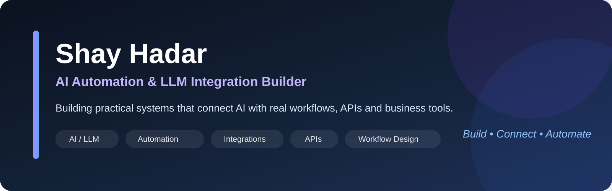
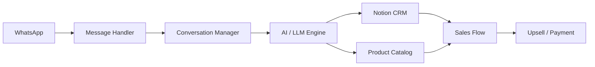

  

# Shay Hadar — AI Automation & LLM Integration Portfolio

Industrial Engineering & Management student with **1+ year of hands-on experience** building AI-powered automations, integrations and workflow solutions.

My main strength is turning a process or idea into a working end-to-end system by connecting **LLMs, APIs, browser workflows, CRM tools and business systems**.

> **Development approach:** I use AI-assisted development extensively. I drive the workflow design, system connections, business rules, prompts, testing, debugging and iteration; AI coding tools assist with implementation and refactoring.

## Core Skills

`AI / LLM Integration` · `Workflow Automation` · `REST APIs` · `Webhooks` · `JSON` · `Notion API` · `Chrome Extensions` · `Shopify` · `JavaScript` · `Python` · `n8n` · `Make` · `AI-assisted Development`

---

# Featured Projects

## 1) WhatsApp AI Sales Agent + Notion CRM

**AI-powered sales assistant that connects WhatsApp conversations with a Notion CRM and product catalog.**

### What it does

- Handles customer conversations through an LLM-powered workflow
- Reads product data from Notion and uses it as sales context
- Creates and updates CRM records for customer interactions
- Supports Hebrew, English and Arabic
- Tracks sales stages and customer session state
- Includes upsell logic and Bit / PayBox payment-link generation
- Uses guardrails for safe and controlled responses
- Includes **188 automated tests** across CRM, products, sessions, prompts and guardrails

### Architecture

**Tech:** `Node.js` · `JavaScript` · `whatsapp-web.js` · `Notion API` · `Gemma API` · `CRM Automation`

**What it demonstrates:** LLM integration, CRM automation, API orchestration, state/session management, business workflow design, testing and guardrails.

**Repository:** [whatsapp-sales-agent](https://github.com/shayhadar850-lab/whatsapp-sales-agent)

---

## 2) Open University AI Learning Studio

**Local AI learning platform that transforms uploaded academic material into structured interactive lessons, Hebrew narration and video lessons.**

### What it does

- Imports course books and assignment files
- Extracts and indexes learning material
- Organizes content into topics and source-grounded lesson flows
- Generates interactive AI lessons and visual explanations
- Produces Hebrew narration and subtitles
- Renders lessons into MP4 video
- Supports Gemini, Ollama Cloud and local Ollama
- Includes MCP-based tooling for generation, editing, quality checks and rendering

### Architecture

**Tech:** `Node.js` · `React` · `Next.js` · `Express` · `Drizzle ORM` · `MCP` · `Gemini` · `Ollama` · `FFmpeg` · `PDF Processing`

**What it demonstrates:** end-to-end AI product design, document ingestion, provider integration, structured-output validation, media generation and orchestration across many components.

**Code status:** Private project — architecture and walkthrough available on request.

---

## 3) Shopify AI Product Page Pipeline

**Chrome extension + local service that turns Shopify source data into validated, publication-ready product pages through an AI-assisted workflow.**

### Workflow

### What it does

- Reads product information through Shopify APIs
- Builds evidence-aware product facts
- Generates titles, descriptions, SEO content and structured theme fields
- Reviews product images and metadata
- Applies validation and QA gates before publish
- Blocks unsupported claims, invalid structures and unsafe HTML
- Protects reference products from accidental writes
- Publishes only products in the correct workflow state
- Performs read-back verification after publishing

**Tech:** `JavaScript` · `Node.js` · `Shopify Admin API` · `Chrome Extension` · `CSV Workflows` · `AI-assisted Content` · `Validation`

**What it demonstrates:** business-process automation, workflow state management, API integration, QA gates, controlled publishing and safe AI implementation.

**Code status:** Private project — architecture and walkthrough available on request.

---

## 4) Pinterest Organic Publishing Automation

**Automation workflow that prepares Shopify products for Pinterest and performs validated bulk publishing.**

### Workflow

### What it does

- Imports and groups Shopify product data
- Creates AI-ready work packages for content generation
- Supports external AI handoff workflows
- Validates returned images, title, description and alt text
- Uploads media to Cloudinary
- Builds Pinterest-compatible Bulk Upload CSV files
- Handles board/category selection, scheduling and publishing states
- Includes defensive error handling for changed UI/selectors
- Evolved through multiple versions with regression testing and workflow improvements

**Tech:** `JavaScript` · `Chrome Extension` · `Shopify CSV` · `Cloudinary` · `Pinterest Automation` · `DOM Automation` · `Validation`

**What it demonstrates:** browser automation, AI-assisted publishing, external-service integration, validation, error handling and iterative product development.

**Code status:** Private project — architecture and walkthrough available on request.

---

## 5) Facebook Marketplace AI Sales Agent

**Chrome extension that connects Facebook Marketplace conversations with AI responses, product data and lead management in Notion.**

### What it does

- Monitors Facebook Marketplace / Messenger workflows
- Processes customer messages and detects intent
- Loads relevant product information from Notion
- Caches product data to reduce unnecessary API calls
- Builds conversation + product context for AI responses
- Uses Groq / Gemini configuration for response generation
- Creates or updates lead information in Notion
- Connects browser automation, AI and CRM logic into one workflow

### Architecture

**Tech:** `JavaScript` · `Chrome Extension` · `Groq` · `Gemini` · `Notion API` · `AI/LLM Integration` · `CRM Automation`

**What it demonstrates:** browser automation, context-aware LLM responses, CRM integration, caching, API orchestration and sales workflow design.

**Code status:** Private project — architecture and walkthrough available on request.

---

# How I Work

I enjoy working at the intersection of **process design, systems integration and AI**.

Typical workflow:

1. Understand the manual process or business problem
2. Map the systems and data flow
3. Define API / webhook / browser integration points
4. Build the workflow and AI logic
5. Add validation, error handling and guardrails
6. Test end-to-end behavior
7. Debug edge cases and iterate until the process is reliable

---

# Roles I’m Targeting

- AI Automation / AI Implementation
- LLM Integration
- Workflow Automation
- Integration / Automation Specialist
- Business Systems Automation
- AI Operations
- Low-Code / No-Code Automation
- Information Systems Integration
- Junior / Student technical implementation roles

---

# Contact

**Shay Hadar**  
Industrial Engineering & Management Student · Israel

**GitHub:** https://github.com/shayhadar850-lab  
**Email:** Shayhadar850@gmail.com

---

<b>Build • Connect • Automate</b>

