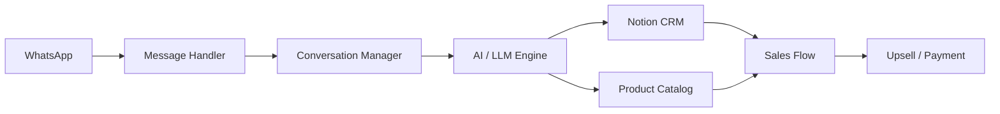

# Shay Hadar — AI Automation & LLM Integration Portfolio

Industrial Engineering & Management student with over a year of hands-on experience building AI-powered automations, integrations, and workflow solutions.

My focus is connecting AI/LLM systems with real business processes, external services, APIs, CRM tools, browser workflows, and operational systems.

## Core Skills

- AI / LLM Integration
- Workflow Automation
- n8n
- Make
- REST APIs
- Webhooks
- JSON
- Notion Integrations
- Chrome Extensions
- Shopify Integrations
- AI-Assisted Development
- Testing, Debugging & Iteration

## Portfolio Visuals

Each featured project includes an architecture/workflow diagram rendered directly by GitHub using Mermaid.

For the final portfolio, add one real screenshot or short GIF for each project. Real product screenshots are intentionally not fabricated here; they should come from the running applications.

Recommended image names:

- `assets/whatsapp-sales-agent.png`
- `assets/open-university-studio.png`
- `assets/shopify-product-pipeline.png`
- `assets/pinterest-organic-publisher.png`
- `assets/facebook-marketplace-agent.png`

Once those files are added, place the matching image directly below each project title.

---

## Development Approach

I use AI coding tools as part of my development workflow.

I focus on understanding the business process, designing the workflow and system connections, defining APIs and data flow, configuring integrations, testing end-to-end behavior, debugging failures and edge cases, and improving the workflow until it works reliably.

AI tools assist me with code generation, refactoring and implementation, while I drive the solution design, integration logic, testing and iteration.

---

# Featured Projects

## 1. WhatsApp AI Sales Agent + Notion CRM

**AI-powered sales assistant connecting WhatsApp conversations with a Notion-based CRM and product catalog.**

### What it does

- Handles WhatsApp conversations through an AI-powered workflow
- Connects customer conversations with Notion CRM data
- Uses Notion as both a customer-management system and product catalog
- Supports Hebrew, English and Arabic
- Tracks customer conversations and sales stages
- Includes upsell logic for complementary products
- Generates Bit / PayBox payment links
- Uses guardrails to reduce unsafe or invalid sales responses
- Includes a large automated test suite

### Architecture

### Technologies

`JavaScript` · `Node.js` · `WhatsApp` · `Notion API` · `Gemma API` · `AI/LLM Integration` · `CRM Automation`

### What this project demonstrates

- LLM integration with a real communication channel
- CRM integration
- conversational workflow design
- API-based system integration
- state and session management
- sales-process automation
- testing and guardrails

**Repository:**  
https://github.com/shayhadar850-lab/whatsapp-sales-agent

---

## 2. Open University AI Learning Studio

**Local AI learning platform that turns uploaded academic material into interactive lessons, Hebrew narration and video lessons.**

### What it does

- Imports course books and assignment files
- Extracts and indexes uploaded learning material
- Organizes content into topics
- Generates structured interactive lessons
- Supports AI-generated visual explanations
- Produces Hebrew narration
- Generates subtitles and MP4 video lessons
- Supports multiple AI providers and local AI execution
- Keeps local course files and indexes on the user's computer
- Includes MCP-based tools for lesson generation, editing, quality checks and rendering

### Architecture

### Technologies

`Node.js` · `React` · `Next.js` · `Express` · `Drizzle ORM` · `MCP` · `Gemini` · `Ollama` · `FFmpeg` · `TTS` · `PDF Processing`

### What this project demonstrates

- end-to-end AI workflow design
- document ingestion and retrieval
- multiple AI-provider integration
- local/private AI workflow options
- structured-output validation
- media generation pipeline
- orchestration of many different services and libraries

**Repository:**  
https://github.com/shayhadar850-lab/open-university-studio

---

## 3. Shopify AI Product Page Pipeline

**Chrome extension + local service that turns Shopify source data into validated, publication-ready product pages through an AI-assisted workflow.**

### Workflow

### What it does

- Reads product information from Shopify
- Builds evidence-aware product facts
- Generates product copy, SEO content and structured theme fields
- Reviews product images and metadata
- Applies quality and validation gates
- Blocks unsupported claims and invalid content
- Protects reference products from accidental writes
- Publishes only products that pass the required workflow state
- Verifies the result by reading data back from Shopify

### Quality & Safety

The workflow contains dedicated validation logic for factual accuracy, brand consistency, unsupported claims, duplicate content, dangerous HTML, spreadsheet formula injection, image completeness, workflow state integrity, and source-data changes.

### Technologies

`JavaScript` · `Node.js` · `Shopify Admin API` · `Chrome Extension` · `CSV Workflows` · `AI-Assisted Content` · `Validation` · `Workflow Automation`

### What this project demonstrates

- business-process automation
- API integration
- state-machine workflow design
- validation and QA gates
- safe AI implementation
- controlled publishing
- operational reliability

**Repository:**  
https://github.com/shayhadar850-lab/byourielle-product-page-pipeline

---

## 4. Pinterest Organic Publishing Automation

**Automation workflow that prepares Shopify products for Pinterest and performs validated Bulk Upload publishing.**

### What it does

- Imports Shopify product data from CSV / supported JSON
- Groups Shopify rows into product-level publishing tasks
- Creates AI-ready work packages
- Supports ChatGPT, Gemini and Claude as external AI handoff options
- Validates returned Pinterest images and metadata
- Uploads media to Cloudinary
- Builds Pinterest-compatible Bulk Upload CSV files in memory
- Opens Pinterest Bulk Create and inserts the generated CSV automatically
- Applies publishing intervals and board/category logic
- Stops safely when required fields, selectors or confirmations are missing

### Workflow

### Technologies

`JavaScript` · `Chrome Extension` · `Shopify CSV` · `Cloudinary` · `Pinterest Automation` · `AI Workflow` · `DOM Automation` · `Validation`

### What this project demonstrates

- browser automation
- AI-assisted content workflow
- external-service integration
- file/CSV automation
- validation and failure handling
- iterative improvement over multiple versions
- automation against changing web interfaces

**Repository:**  
https://github.com/shayhadar850-lab/pinterest-organic-publisher

---

## 5. Facebook Marketplace AI Sales Agent

**Chrome extension that connects Facebook Marketplace conversations with AI responses, product data and lead management in Notion.**

### What it does

- Monitors Facebook Marketplace / Messenger workflows
- Processes incoming customer messages
- Detects basic message intent locally
- Loads relevant products from Notion
- Uses cached product data to reduce unnecessary API calls
- Builds AI context from the current conversation and product information
- Generates AI-based customer responses
- Creates or updates lead information
- Supports Groq / Gemini-based AI configuration
- Connects Marketplace conversations with Notion products and lead databases

### Architecture

### Technologies

`JavaScript` · `Chrome Extension` · `Groq` · `Gemini` · `Notion API` · `AI/LLM Integration` · `CRM Automation`

### What this project demonstrates

- LLM integration
- browser-based automation
- CRM / lead-management integration
- context-aware AI responses
- API orchestration
- caching and workflow logic

**Repository:**  
https://github.com/shayhadar850-lab/fb-marketplace-agent-extension

---

# Additional Experience

Across my projects, I have worked with:

- REST APIs
- Webhooks
- JSON-based integrations
- Notion API
- Shopify APIs
- browser / Chrome extension automation
- AI model integrations
- workflow validation
- data transformation
- session and state management
- automated testing
- debugging and edge-case handling
- AI-assisted software development

---

# Target Roles

I am currently interested in Student / Junior opportunities in:

- AI Automation
- AI Implementation
- LLM Integration
- Workflow Automation
- Integration / Automation Specialist
- Business Automation
- AI Operations
- Low-Code / No-Code Automation
- Information Systems Integration

---

# Contact

**Shay Hadar**  
Industrial Engineering & Management Student  
Israel

**GitHub:**  
https://github.com/shayhadar850-lab
